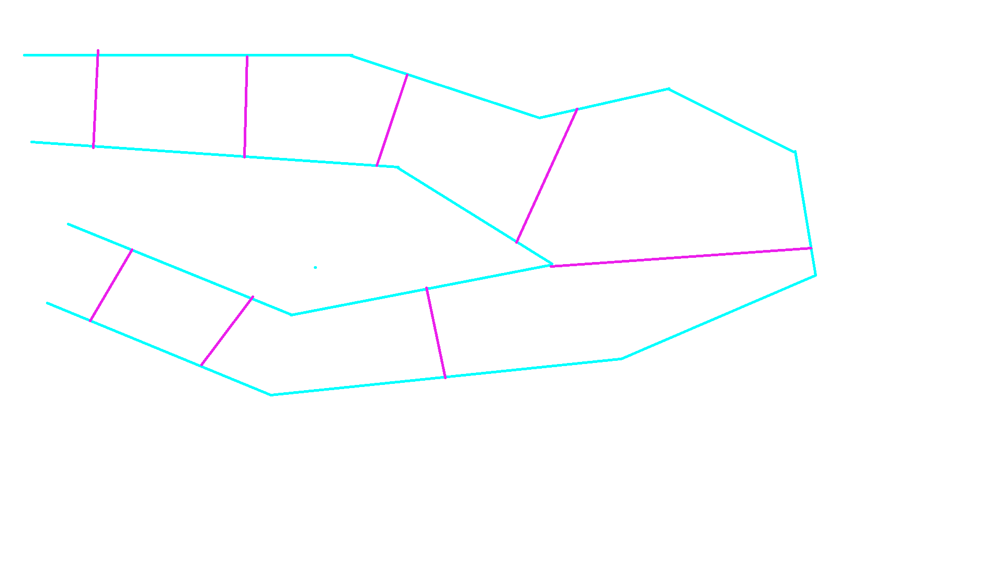
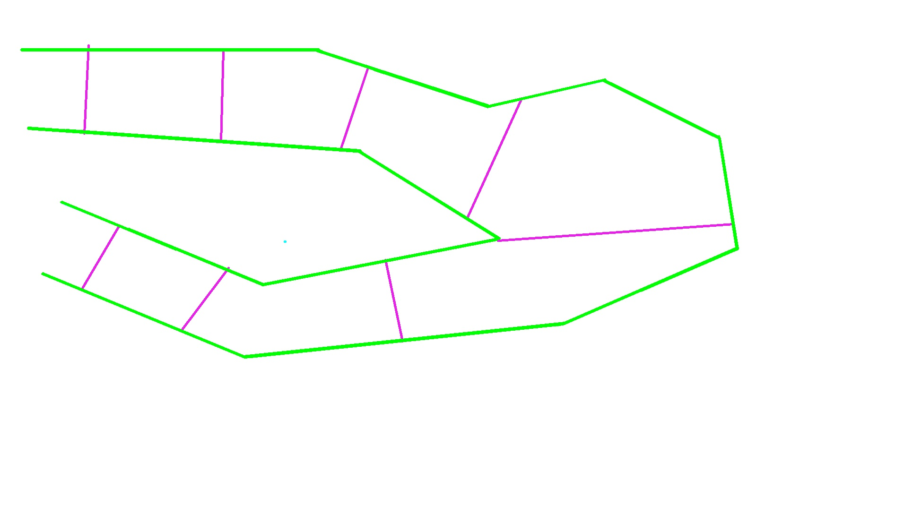
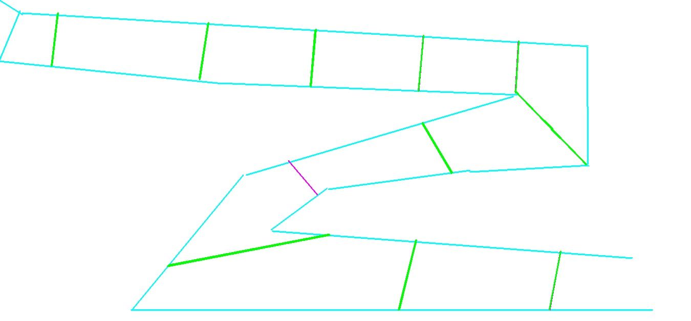

# RL PROJECT

### Self-driving car using Deep Q Learning Network

#### Progress 

- Gym environment complete 
- Module to change the track according to users drawing complete
- Graphical representation incomplete

#### Tracks
User can change the tracks used to train the agent by drawing the desired map in paint and using specific colours to draw track lines and checkpoints

Colors used:
- for tracks: #5AFFFF
- for reward checkpoints: EB1FEB

Change the filename in TRACK_NAME variable in gym.py to the file name

You can check how well is the track generated by checking 

This shows the tracks generated by the module in neon color

This shows the checkpoints generated by the module in neon color

